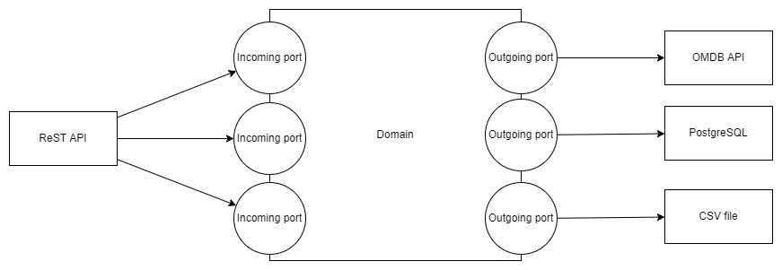
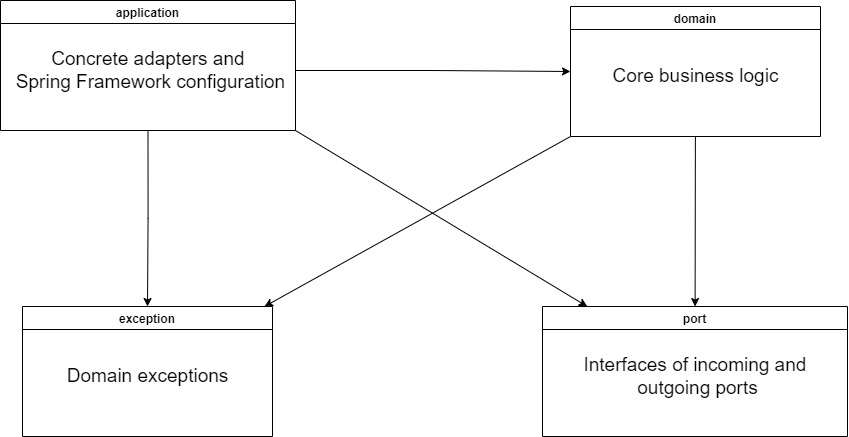

# Ports and Adapters architecture

This solution features use of "Ports and Adapters" architecture, in which business logic depends on no other module,
while other modules depend on business logic.
Such low coupling is possible with the help of ports (points, where external systems and our application make
interaction) and adapters to them (concrete implementations of these interactions).

## Use cases

For us ports are multiple use cases (user can search for film, user can rate film etc.), database, external API
for film descriptions, Oscar winners, and adapters are Spring controllers to accept HTTP requests, PostgreSQL, OMDB API,
bundled csv file.
It enables us to change database, source of film descriptions, source of Oscar winners, protocol for communicating with
application, even the framework without touching (mostly) core domain.
We can change them in the future for improvement purpose or change it while testing for stubs.
Here is overview of the structure of the system:

## Test Driven Development

Such approach also helps with Test Driven Development.
As you can see, tests are designed by the "black box" principle: they are focused on API rather than implementation.
Implementation of core domain can be changed without affecting tests much.

The application is built with strong encapsulation in mind: only a handful of classes are public.
Here you can see directions of dependency between packages:
